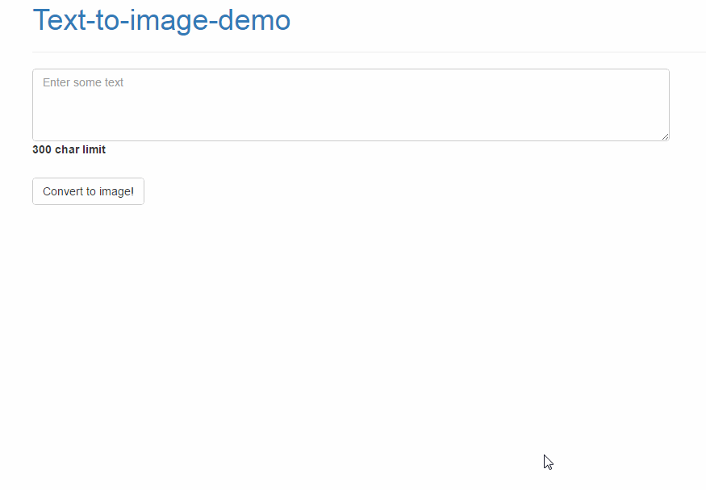
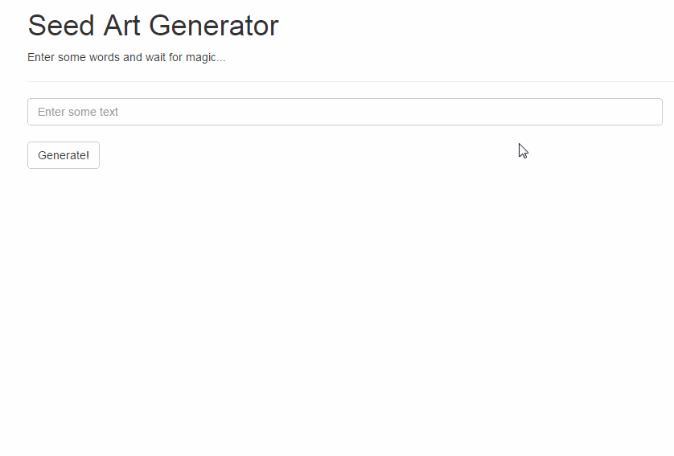

<h1>Text-to-image converter</h1>
<p>Takes a string and converts it into an image. The script adds line breaks to the string and dynamically adjusts the height depending on the number of lines.</p>
<br>


<h3>In this project:</h3>
<p>This project contains the <strong>text-to-image.php</strong> and</p>
<ul>
<li>A web demo using the text-to-image.php: <strong>text-to-image-demo.php</strong></li>
<li>Another demo that adjusts color, art, figures in the image: <strong>art-generator.php</strong></li>
<li>An example use--display an email address as an image--under <em>email-example/</em></li>
</ul>

<h3>How to use:</h3>
<p>Include: </p>
`include 'text-to-image.php';`
<p>Pass a string through the function:</p>

  ```php
  $string = 'Pass strings like this or from a form using POST';
  $image = new image;
  $image->makeImageFromString($string);
  ```
  
 <p>The result will look something like this:</p>


<br>

<h3>art-generator.php Demo</h3>


<h3>Capabilities</h3>
<p>Can be used to create reCAPTCHA-esque images for spam prevention, generate unique images for users, store display user emails in a photo to prevent spammers from obtaining this information, and so on.</p>

<h3>Install</h3>
Install by cloning: `git clone git@github.com:harmankang/text-to-image-php.git`
<br>
<h3>Run</h3>
<p>I will not put this in the readme, so google "How to run PHP scripts on my computer." It takes less than 5 minutes to set up.</p>
<p>Open in browser and enjoy!</p>


